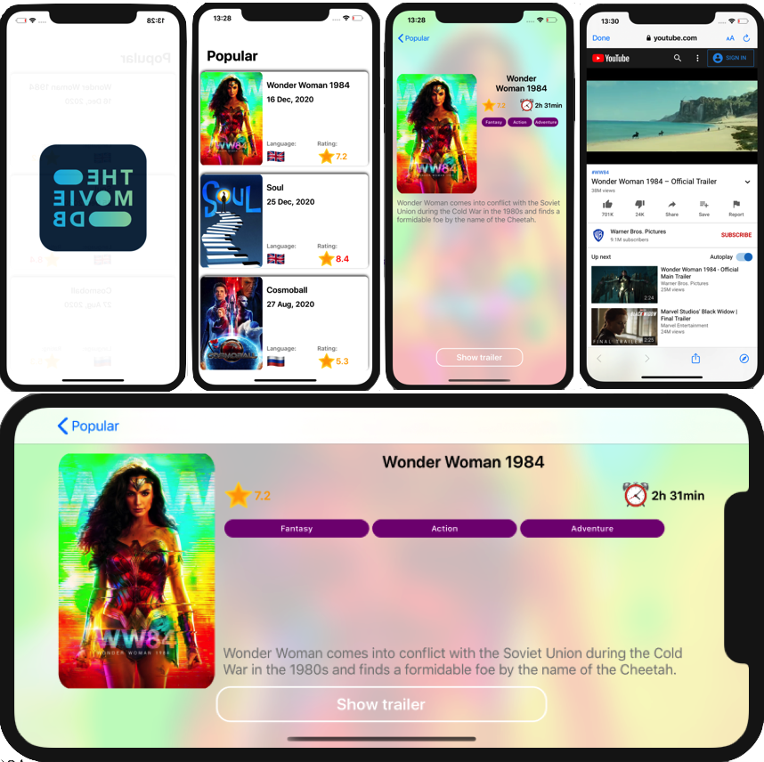

# iMovies

iMovies - Application for watching movies at https://www.themoviedb.org/.

Фильмы - Приложение для просмотра фильмов на https://www.themoviedb.org/.

https://youtu.be/XBHsc7oJgv8

Used:
- Swift
- Protocols
- Extension
- DispatchQueue
- Program Interface
- Autolayout
- MVC
- JSON
- Localizable

UIKit:
- UIViewController
- UITableViewController
- UITableViewCell
- UIStackView
- UICollectionView
- UICollectionViewCell
- Basic UIView Animation
- UIBlurEffect
- UIAlertController
- UIRefreshControl

Foundation:
- URLSession
- DateFormatter
- Timer

SafariServices:
- SFSafariViewController

Pattern:
- Coordinator

API:
- https://developers.themoviedb.org/    

